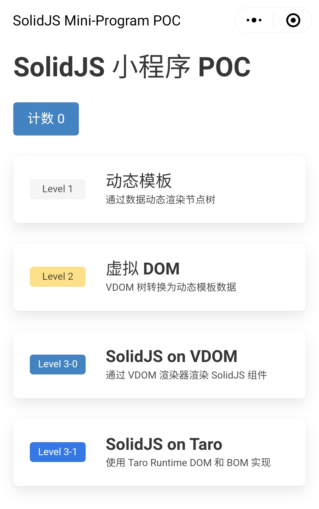

# SolidJS Mini-Program POC

在小程序上使用动态模板和虚拟 DOM 集成 [SolidJS](https://www.solidjs.com/) 的概念验证及研究

后续将考虑基于此研究结果为 [Taro](https://github.com/NervJS/taro) 贡献 SolidJS 支持

| Package                                                      |                                                                                                                                                                           |
| ------------------------------------------------------------ | ------------------------------------------------------------------------------------------------------------------------------------------------------------------------- |
| [solid-mp-vdom](./packages/solid-mp-vdom/)                   | 用于 SolidJS universal renderer 的最简 DOM 实现, 可以将节点树映射为动态模板数据, 类似于 [@tarojs/runtime](https://github.com/NervJS/taro/tree/next/packages/taro-runtime) |
| [solid-mp-vdom-renderer](./packages/solid-mp-vdom-renderer/) | 使用 `solid-mp-vdom` 的虚拟 DOM 实现的 SolidJS [universal renderer](https://github.com/solidjs/solid/tree/main/packages/solid/universal#readme)                           |
| [solid-mini-program](./packages/solid-mini-program/)         | 示例小程序实例, 包括了动态模板、虚拟 DOM、`solid-mp-vdom-renderer`上的 SolidJS、`@tarojs/runtime`上的 SolidJS 等概念的示例页面                                            |

### 截图

